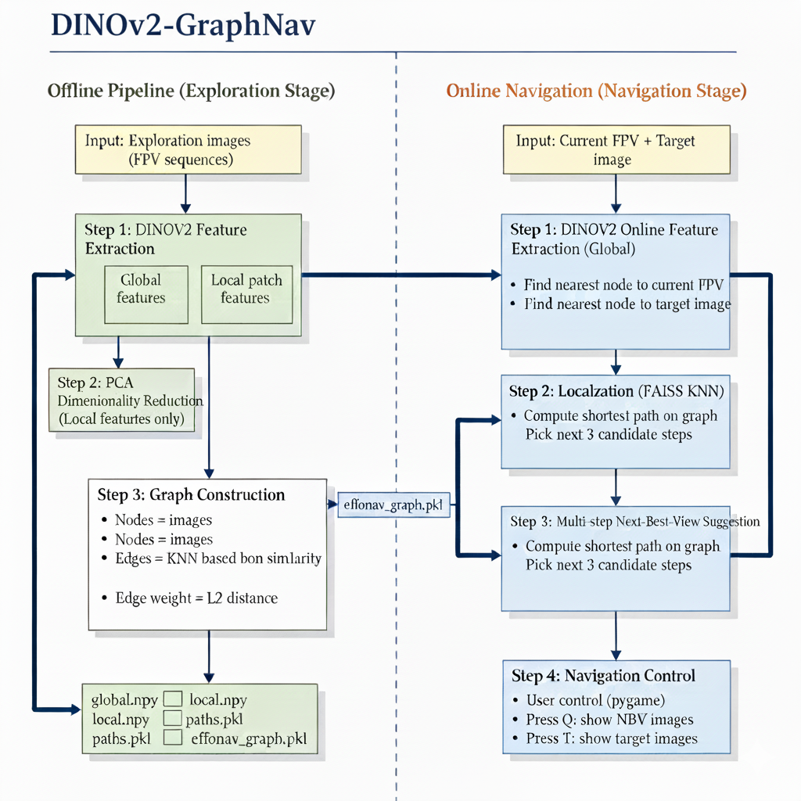
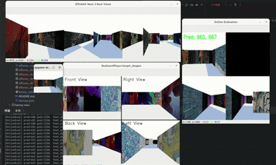

# DINOv2-GraphNAV

Visual Navigation via Offline DINOv2 Feature Graph & Online Global Matching



##  Overview

**DINOv2-GraphNAV** is a visual-navigation framework that builds a **topological graph** from offline exploration trajectories using **DINOv2 global and local features**, then performs **real-time localization and navigation** with a lightweight online backbone.

This project is designed for the *Embodied AI Visual Navigation Challenge* and integrates the following components:

###  Offline Processing
- **DINOv2-B/14 global feature extraction** for viewpoint-invariant embeddings  
- **Local patch tokens + PCA reduction** to capture fine-grained spatial cues  
- **K-NN graph construction** connecting visually similar frames  
- **Weighted edges** reflecting both global and local similarity  
- **Serialized assets** saved as:  
  `*_global.npy`, `*_local.npy`, `*_pca.pkl`, `*_graph.pkl`, `*_paths.pkl`

### Online Navigation
- **Fast DINOv2-S/14 global feature extraction** (real-time)  
- **FAISS nearest-neighbor search** to localize the agent  
- **Graph-based shortest-path routing** using A*/Dijkstra  
- **Multi-step Next-Best-View (NBV) guidance** for aligned navigation decisions  

Together, these components form a robust graph-based navigation pipeline that is:  
**model-agnostic**, **scalable**, and **capable of generalizing from offline exploration to online execution.**


##  Project Structure

```text
DINOv2-GraphNAV/
│── build_graph.py               # Offline feature extraction + graph building
│── effonav_config.json          # Config for offline graph generation
│── effonav_dino_global.npy      # Global feature bank (offline)
│── effonav_dino_local.npy       # Local patch features (offline)
│── effonav_dino_pca.pkl         # PCA transformer for local_dim reduction
│── effonav_dino_graph.pkl       # Precomputed navigation graph
│── effonav_dino_paths.pkl       # Image paths for offline nodes
│── kenny_online.py              # Online navigation player
│── dinov2.jpg                   # System pipeline diagram
│── data/
│     └── images_subsample/      # Offline exploration frames
│── target.jpg                   # Example target
│── startup.json                 # For vis_nav_game
```


##  Key Features

###  Offline Pipeline (Build-Time)
- Extract **DINOv2-B/14 global features**
- Extract **local patch tokens**
- Apply **PCA** on local features for compactness
- Build **image similarity graph** with k-NN
- Store all outputs:  
  `global.npy`, `local.npy`, `pca.pkl`, `graph.pkl`, `paths.pkl`

###  Online Pipeline (Run-Time)
- Use **DINOv2-S/14** for fast global feature extraction
- Perform real-time localization via **FAISS nearest neighbor**
- Retrieve nearest offline frame (node)
- Navigate by following **shortest path** (A*/Dijkstra)
- Display **multi-step Next-Best-Views (NBV)** for guidance
