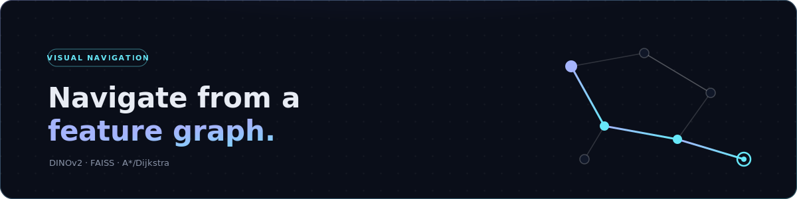
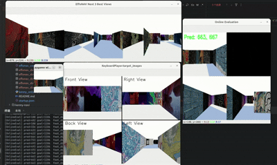
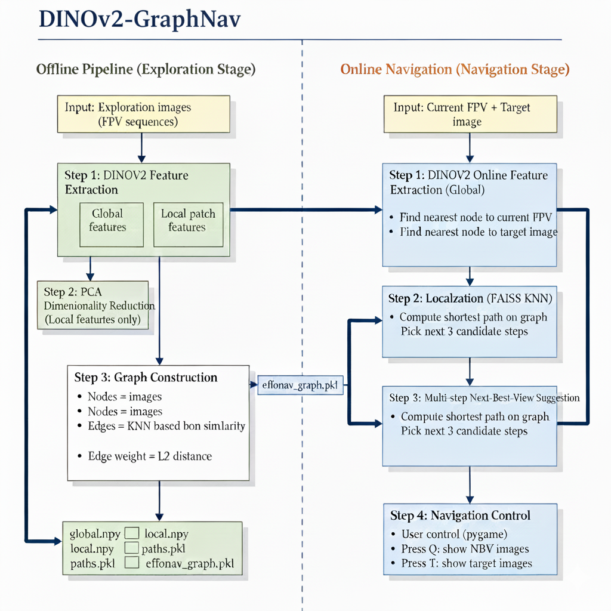

  

### Explore once, navigate forever. A robot builds a map out of what it *sees* — then finds its way to any target by matching views and walking the graph.

 

  

 

## The idea

Give an agent a set of exploration frames and it builds a **topological map** where each node is a place it has seen and each edge links visually similar places. At run time it takes its current camera view, finds the closest node, and follows the shortest path to wherever you point it — no metric SLAM, no pre-built floor plan. Built for the *Embodied AI Visual Navigation Challenge*.

  

 

## How it works

**🗺️ Offline — build the map**
- **DINOv2-B/14** global features give each frame a viewpoint-invariant fingerprint
- Local patch tokens (PCA-reduced) add fine-grained spatial detail
- A **k-NN graph** links visually similar frames, with edges weighted by global + local similarity

**🧭 Online — find the way**
- A lightweight **DINOv2-S/14** backbone fingerprints the live view in real time
- **FAISS** nearest-neighbor search snaps the agent onto the closest node
- **A\*/Dijkstra** routes to the target, with multi-step **next-best-view** guidance to keep heading and view aligned

The result is a navigation pipeline that is model-agnostic, scalable, and generalizes from offline exploration to online execution.

 

## Under the hood

The offline stage serializes its work as reusable artifacts — global/local feature banks, the PCA transform, the k-NN graph, and node-to-image paths — so navigation starts instantly without re-encoding the environment. Implementation lives in the `dinov2_effonav` module.

 

A computer-vision project by <a href="https://kenny0312.github.io">Kenny Qiu</a> &nbsp;·&nbsp; see also <a href="https://github.com/kenny0312/videosense-agent">VideoSense Agent</a> and <a href="https://kenny0312.github.io/social-video-insights/">SocialLens</a>

